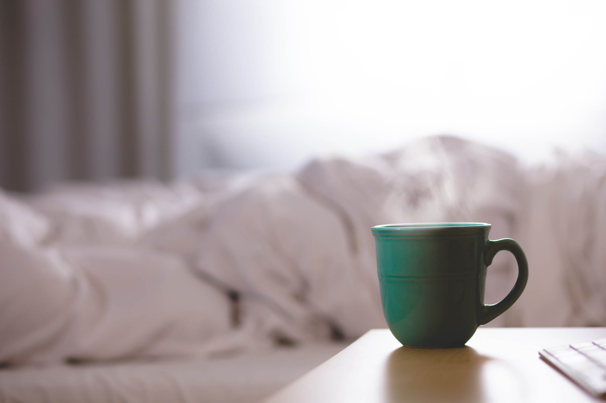
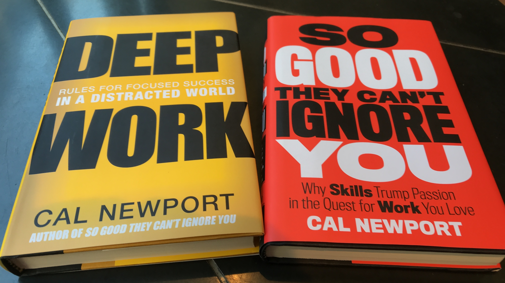

I’ve been living in Montréal for almost two years now. I’m currently going in vacation in France to see friends and family, for the fifth time in these two years. Montréal is not that far from France. You take off on the evening, and you arrive early on the morning. (Short night though.) For the return it’s even shorter: you land only a couple hours after taking off, thanks to the time shift.

Each trip in France is the occasion to experience again the jet lag. Sometimes the jet lag is very annoying. For instance when I arrive in France, during the first days, I can’t sleep at night, and of course I can’t get up in the morning. But usually I don’t have much to do when I’m there, so it’s bearable. When I come back to Montréal on the other way, it’s a fantastic opportunity to get up very early on the morning. For maybe a week you wake up around 5am, you’re the first to arrive at the office, and the morning can be very productive. Unfortunately after a few days the magic disappears, and you welcome back your alarm clock.

<figure>
  
  <figcaption>
    Photo by <a href="https://unsplash.com/@itsdavo?utm_source=unsplash&utm_medium=referral&utm_content=creditCopyText">David Mao</a> on <a href="https://unsplash.com/search/photos/sleep?utm_source=unsplash&utm_medium=referral&utm_content=creditCopyText">Unsplash</a>
  <figcaption>
</figure>

Last summer I took a decision I’ve never regretted. Instead of letting the “normal” rhythm come back, I set my alarm to 6am every morning. The first days I woke up before, but then it became my normal waking up time. By waking up at 6, I was at the job at 7am. Working completely alone until 9, I felt more productive than I’d ever felt before. Most of my colleagues started their day at 9:30. When they finished their first cup of coffee, I had already accomplished the most important part of my daily tasks. Especially the most intellectual ones. The ones that I could be very efficient working alone, in a deep work state. The rest of the day was dedicated to meetings, helping other developers, code review… And around 4pm my day was over, while others still have to work one or two hours.

After around a month of this new fantastic rhythm, I took a step forward, and decided to include physical training in my morning routine. Cold was coming to Montréal, so I subscribed to a discount gym, located just a few floors beneath my working place. Instead of starting working at 7, I went to the gym at 7 and to the office at 8. Although very proud my myself (working out has never been an easy habit for me to take), I missed arriving at work at 7. Mornings seemed shorter and less productive than before. So new decision: from this moment I would get up at 5:30 and go straight to the gym.

<figure>
  
  <figcaption>
    Photo by <a href="https://unsplash.com/@gpthree?utm_source=unsplash&utm_medium=referral&utm_content=creditCopyText">George Pagan III</a> on <a href="https://unsplash.com/search/photos/this-way?utm_source=unsplash&utm_medium=referral&utm_content=creditCopyText">Unsplash</a>
  <figcaption>
</figure>

I didn’t even take the time to take a shower, nor to have breakfast. I figured out that to keep the habit and the motivation to go to the gym, I needed to go out as fast as possible. No time to think, just dress up and leave. I even prepared my gym bag (and lunch box) on the evening before going to bed. By waking up at 5:30, I left home at 5:40, and was at the gym around 6:10. A few weeks later, I shifted my alarm to 5:15, and I kept it that way since then. I took my shower at the gym, and my breakfast at the office.

---

I set up some constraints to myself to be able to keep this routine. Some of them I still respect, some I don’t need/want to.

First, if you want to wake up early, you need to go to bed early. It may seem obvious, but it wasn’t my intention to sleep less on the week, to catch on on the weekend. I established I needed 8 hours of sleep every night to feel totally rested during the day. So I started getting to bed at 9pm. And I still do. I was afraid that I would miss some social interaction, with colleagues and friends. It wasn’t long til I felt tired around 9, and sometimes the party hasn’t even started at that time. Actually it hasn’t been a problem.

In Montréal, it’s not that unusual to go out from 6pm, and go home around 10. The day of work usually ends at 5pm, so naturally when we go out with colleagues, we rarely finish that late. Same with friends on the weekend. There weren’t a lot of occasion when I felt I missed anything because I went home earlier. Plus it wasn’t just discipline. I never went home before I felt I had to. Just, I was tired.

The second constraint I set to myself at the beginning was to get up early even on weekends. I don’t know if this was required to maintain the morning rhythm. The fact is that it wasn’t that difficult, and in the same way I felt more productive at work on business days, I felt more productive during the weekends too. I worked out, went out (I went to take some photos of the sunrise over the Old Port of Montréal), and at that time I dedicated an important part of my leisure time to [writing my book](/posts/2019-02-14-so-i-wrote-a-technical-book/). Still, I didn’t succeed to keep this habit on the weekends. But I still wake up a lot early than before. A year ago, I used to get up at 10 or 11 on weekends. Now it’s usually around 8, almost never after 9. And it didn’t make me stop getting up at 5:15 the other days.

<figure>
  
  <figcaption>
    The kind of photo you can make if you get up early in Montreal 
    <a href="https://www.instagram.com/p/BqUp48BhIxd/">(Instagram)</a>
  <figcaption>
</figure>

Finally, when I started getting up early, I expected of myself to get up early no matter what. There were a few times I went home after midnight after a few too many drinks. Too bad for me, I still woke up at 5:15, and was at the gym at 6. Not the most active work out sessions (they were mostly cardio, risk to get injured was too high with other kinds of exercises). Again, I haven’t kept this rule for a long time. Now I accept to get up later and skip the gym if I’m too tired. But I’ll still be at the office at 7.

---

When I started with this habit, it was the time I also started reading and listening a lot of books. Nonfiction books mostly, about diverse subjects such as productivity, personal development, business, science, personal finance… When I say “a lot”, I mean that on some weeks I was able to finish three books. Usually one I read on my Kobo e-reader during commute, one I listened at the gym and each time I was doing something that didn’t require a lot of concentration (cooking, house cleaning…), and one I read at home.

<figure>
  
  <figcaption>
    Two of my preferred nonfiction books, by Cal Newport 
    <a href="https://www.goodreads.com/author/show/147891.Cal_Newport">(Goodreads)</a>
  <figcaption>
</figure>

Among the books I preferred and still considered as some of the best books I’ve read, _Deep Work_ by Cal Newport. It guided me to make my work days more productive (beginning the day early is an excellent start). Another one, _The Power of Habit_ by Charles Duhigg. Very deep analysis about how and why habits exist, and how you can create good ones, and abandon the bad ones.

I could and probably will write a post about this reading habit, and some more about each of the books I preferred. But one of the books I read is particularly related to my new morning routine.

<figure class="small-right">
  
  <figcaption>
    Miracle Morning by Hal Elrod
    <a href="https://www.goodreads.com/book/show/17166225-the-miracle-morning">(Goodreads)</a>
  <figcaption>
</figure>

_Miracle Morning_ is a bestseller and inspired a lot of people. The pitch: take the habit of waking up early (around 5), and create a routine so when it’s 8 you’ve already accomplished most of what you wanted to do in a day (non-work related). This includes reading, working out, meditating, writing, etc. I heard about this book a long time ago, so obviously when I discovered that I loved waking up early and needed to read so many books, I put that one on my list.

I liked this book a lot. It gives a lot of ideas of things to do and ways to organize your morning routine. An easy life hack to make getting up easier: put your alarm clock far away from your bed. When it rings, after turning it off, immediately go brush your teeth, then drink a whole glass of water. It’s impressive how it is effective. Brushing my teeth revealed itself to be an excellent task to slowly wake up. Every time I hear the alarm, I tell myself that I can go back to bed if I want, but only after brushing my teeth and drinking a glass of water. And it’s astonishing how rarely this happens. At that moment, I don’t even want to go to bed anymore.

I tried some elements of the routine described by the author, and although it was very nice, I didn’t succeed to keep all of them. Meditation for instance was an interesting experience (I followed the free plan of the app [Petit Bambou](https://www.petitbambou.com)). So was writing; I remember loosing inspiration about what to write about.

Still, I think I kept the most important elements of the Miracle Morning routine: getting up early (obviously), working out, and reading (in the metro). But if I’m currently on vacation for two weeks, it means that when I come back I’ll once again have a fantastic opportunity to rethink my morning routine for a fresh new start. For instance, a few weeks ago I started journaling thanks to [Day One](https://dayoneapp.com/) app. I will definitely re-introduce writing and meditation into my morning routine.

<figure>
  
  <figcaption>
    Photo by <a href="https://unsplash.com/@dsmacinnes?utm_source=unsplash&utm_medium=referral&utm_content=creditCopyText">Danielle MacInnes</a> on <a href="https://unsplash.com/search/photos/morning?utm_source=unsplash&utm_medium=referral&utm_content=creditCopyText">Unsplash</a>
  <figcaption>
</figure>

Sometimes you take decisions without having thought a lot about it before, and they reveal themselves to be some of the best decisions you’ve ever made. This was definitely the case with my decision of getting up early. I’ve always felt I liked morning a lot. When I occasionally had to get up early on weekends, I appreciated the sunrise, the quiet and peaceful streets or the cold so much that many times I told myself I should definitely try to get up this early more often. Once again, a good habit you just plan but never apply.

When I saw the opportunity of starting this habit for real, I jumped on it. The thing is I don’t consider myself as someone with a lot of self-discipline. I admitted that to myself a long time ago, but to be honest I don’t feel that different to most of people I know. Still, I knew that if getting up early was difficult, I would fail doing it. So was going to the gym everyday. So I had to make it easy and rewarding. By taking the jet lag as a start, by optimizing every aspect of the routine (preparing my gym bag the day before, leaving home as early as possible), and by enjoying what it leads to (including a huge increase of productivity at work), it actually is easy.

Dear reader who reached the conclusion this post, I can’t recommend you enough to try to get up early, as I started to do one year ago. But more generally, the lesson I learnt was that if you see an opportunity to adopt a new good habit, an opportunity to make it easy and rewarding, seize it no matter what. By questioning every habit you have or would like to have, you’ll discover more about yourself than you can imagine. But most important, you’ll improve your life. Not less than that.
