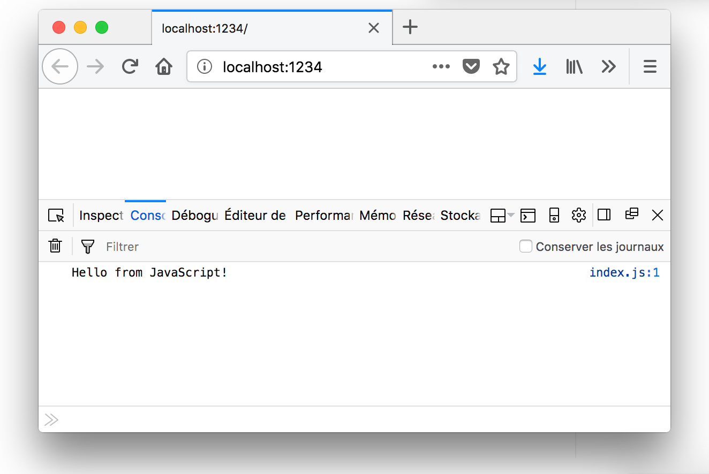
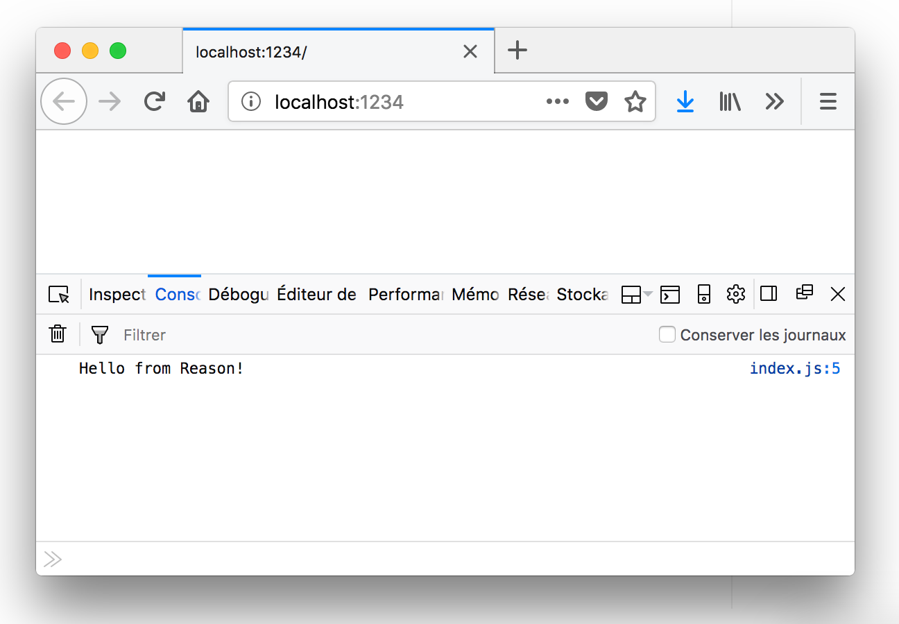
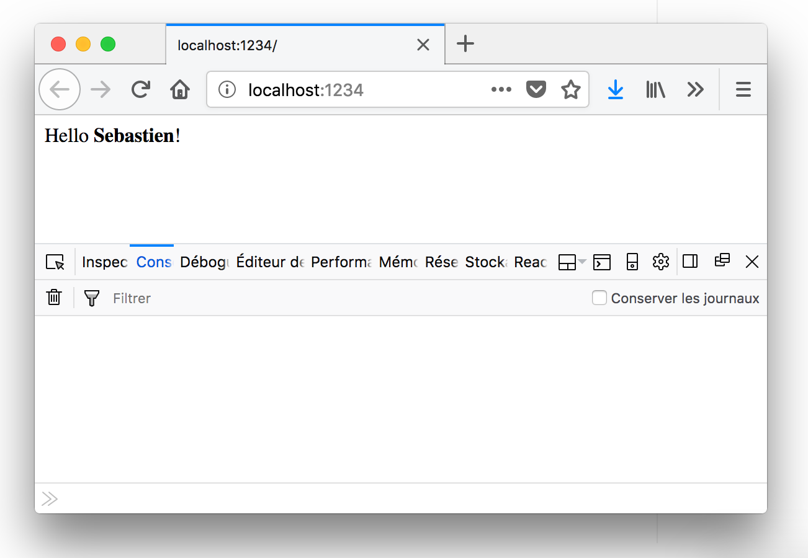

Not that long ago I used Create-React-App a lot to quickly boostrap my React projects. That’s why I naturally used [Reason Scripts](https://github.com/reasonml-community/reason-scripts) when I wanted to use Reason-React. But even if I still understand the advantages of the approach of CRA and Reason Scripts, I recently discovered [Parcel](https://parceljs.org/), a very minimalist bundler for web projects.

There are already a lot of articles explaining the advantages of Parcel, and [how to use it with React](http://blog.jakoblind.no/react-parcel/) for instance. What I wanted to do here is show you how you can use it to start a new project with [Reason](https://reasonml.github.io/) first, then add [Reason-React](https://github.com/reasonml/reason-react) to write React components.

<!--readmore-->

_TL;DR: I created a [project on GitHub](https://github.com/scastiel/parcel-reason-react) containing the final code for the article, if you just want to see the final result._

## Start a basic Parcel project

First, let’s init a new project with Yarn (NPM should work just fine too) and add Parcel:

```bash
$ mkdir reason-parcel && cd reason-parcel
$ yarn init -y
$ yarn add --dev parcel-bundler
```

Let’s edit the generated _package.json_ to add the `start` script:

```json
{
  "name": "reason-parcel",
  "version": "1.0.0",
  "main": "index.js",
  "license": "MIT",
  "scripts": {
    "start": "parcel public/index.html"
  },
  "devDependencies": {
    "parcel-bundler": "^1.6.2"
  }
}
```

Then let’s create our _public/index.html_ file:

```html
<html>
<body>
  <script src="../src/index.js"></script>
</body>
</html>
```

And finally let’s add a `src/index.js` file so we can test our first version:

```js
console.log('Hello from JavaScript!')
```

To start the project, let’s just run `yarn start`:



## Add Reason

Okay this was basically the tutorial to start a Parcel project, but where is Reason? Let’s start by adding `bs-platform` dependency to the project:

```bash
$ yarn add bs-platform
```

We’ll need a `bsconfig.json` file to tell BuckleScript what to do:

```json
{
  "name": "reason-parcel",
  "refmt": 3,
  "sources": "src",
  "dependencies": [],
  "package-specs": {
    "module": "commonjs",
    "in-source": true
  },
  "suffix": ".bs.js"
}
```

We are telling BuckleScript to compile Reason files to JavaScript in the same directory, with `.bs.js`, so our _src/index.re_ will be compiled to _src/index.bs.js_. This way Parcel will be able to deal with them natively.

Let’s create this _src/index.re_ file (by renaming _src/index.js_ file to _src/index.re_) and set its content to:

```reason
Js.log("Hello from Reason!");
```

We also need to update our _public/index.html_ with the new path of the main file, which is now written in Reason:

```html
<script src="../src/index.re"></script>
```

Let’s start our app now:



There it is! Only one command to run the project including Reason to JavaScript transpilation! 😁

## Add Reason-React

Last step now: adding Reason-React to the project so you can write your components in Reason. First we need to add the dependency:

```bash
yarn add reason-react
```

We also need to update _bsconfig.json_ to tell BuckleScript we’ll use Reason-React and JSX:

```json
{
  "name": "reason-parcel",
  "refmt": 3,
  "sources": "src",
  "bs-dependencies": ["reason-react"],
  "reason": {
    "react-jsx": 2
  },
  "dependencies": [],
  "package-specs": {
    "module": "commonjs",
    "in-source": true
  },
  "suffix": ".bs.js"
}
```

Now let’s create a simple component in _src/Greeting.re_:

```reason
let component = ReasonReact.statelessComponent("Greeting");

let make = (~name, _children) => {
  ...component,
  render: (_self) =>
    <div>
      (ReasonReact.stringToElement("Hello "))
      <strong> (ReasonReact.stringToElement(name)) </strong>
      (ReasonReact.stringToElement("!"))
    </div>
};
```

Let’s use it in _src/index.re_:

```reason
ReactDOMRe.renderToElementWithId(<Greeting name="Sebastien" />, "root");
```

And finally let’s add a `root` div to our _public/index.html_ to render our component:

```html
<html>
<body>
  <div id="root"></div>
  <script src="../src/index.re"></script>
</body>
</html>
```

Wow that’s it! Easy right? Here is what you should get in your browser:



Now you’re ready to use React to build powerful and maintainable components and enjoy the possibilities of Reason in the same time. Of course it isn’t the only way to do so, but I like how elegant the method with Parcel is.

I’d be curious to know if you see improvements to this workflow. Maybe using Parcel [packagers](https://parceljs.org/packagers.html) or [plugins](https://parceljs.org/plugins.html) could make it even cleaner? 😉

Some resources:

- [Reason](https://reasonml.github.io), [Reason-React](https://reasonml.github.io/reason-react/), [Reason-Scripts](https://github.com/reasonml-community/reason-scripts) websites will show you how to create a Reason-React app the "official" way.
- [Parcel](https://parceljs.org)’s website has [a page showing how to use React with it](https://parceljs.org/recipes.html), and recommends an [detailled article](http://blog.jakoblind.no/react-parcel/).
- You’ll also find on Parcel website the [documentation to use Reason with it](https://parceljs.org/transforms.html#reasonml/bucklescript).
