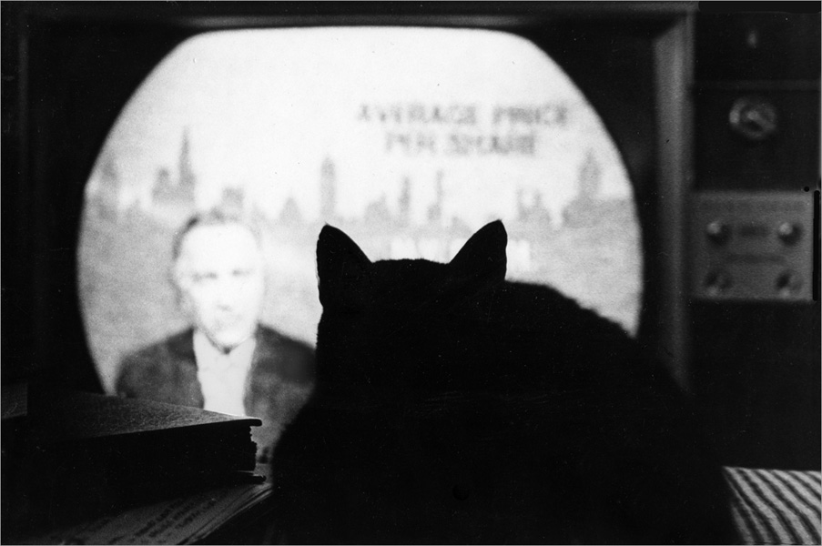

En réponse à [cet article sur Medium](https://medium.com/france/ex-junkie-de-la-t%C3%A9l%C3%A9vision-j-ai-tir%C3%A9-un-trait-sur-mon-addiction-92dbe0ae1075), voici mon retour d’expérience sur la suppression de la télé de mon quotidien. Pour commencer, je pense avoir été plus modéré dans le sens où la télé trône toujours en pièce maîtresse de mon salon, et elle est même souvent allumée. Pour regarder des films, des séries sur Netflix ou autres, mais quasiment jamais sur la « télé » au sens « chaînes de télé ».

<figure>
  
  <figcaption>
    <a href="https://flic.kr/p/nAQB1V">Source</a>
  </figcaption>
</figure>

Comme pour Joël, il y a encore quelques mois, la télé occupait une grande part de mon rythme de vie.

Ça commençait le matin pendant mon petit déjeuner sur les chaînes d’infos. Pour peu que le petit déjeuner dure assez longtemps, il m’arrivait même de zapper sur une autre chaîne d’infos quand les reportages tournaient en boucle…

Puis le soir en rentrant : soi-disant fatigué de ma journée, l’envie de poser mon cerveau et de ne surtout pas faire quelque chose de constructif m’envahissait… D’abord des émissions débiles genre « Un dîner presque parfait », puis c’était parti pour Canal+ : le JT, et bien sûr la grand-messe du Grand Journal, les Guignols et autre Petit Journal.

J’enchaînais avec le programme de la soirée : au mieux un film que j’avais probablement déjà vu, parfois même que j’avais en DivX quelque part ; au pire une série policière comme on en voit tant.

Voici les quelques constats que je fais avec le recul :

- Tout d’abord la télé n’était la plupart du temps allumée que pour assurer une présence dans mon appartement. À part le matin où j’étais un minimum concentrée sur les infos, je faisais généralement autre chose, je ne suivais pas toujours ce qui s’y disait.
- Ensuite, l’omniprésence de la publicité. C’est tellement dingue que lorsqu’on regarde énormément la télé comme je le faisais, on ne la remarque même plus  –  mais inconsciemment on s’en imprègne et on devient même « expert en pub » (« Ah tiens voici donc la nouvelle pub Renault dont j’ai entendu parler. C’est vrai qu’elle est sympa… »).
- Enfin, le plus important, lorsqu’on regarde beaucoup la télé on est persuadé que c’est bon pour rester au courant. Parce que je regarde tous les JT, je suis parfaitement à la pointe de l’actualité. Parce que je regarde le Grand Journal, j’assiste aux débats politiques et je suis au courant des tendances culturelles. Et parce que je regarde beaucoup de films, j’entretiens mon côté cinéphile.

<figure>
  
  <figcaption>
    <a href="https://www.flickr.com/photos/dannysoar/12225457465/">Source</a>
  </figcaption>
</figure>

À présent tout ceci me paraît un brin ridicule. Je n’ai pas arrêté la télé comme ça parce que je l’avais décidé du jour au lendemain. Juste parce qu’un jour je n’ai pas eu envie d’allumer la télé. Puis le lendemain non plus, ni le jour d’après. Et ça ne m’a pas manqué. Pourquoi ?

**Parce que** plutôt que d’allumer la télé tout le temps, j’écoute plutôt de la musique ou la radio.

**Parce que** ne plus entendre de publicité dans mon appart’ à longueur de journée fait un bien fou.

**Et surtout**, surtout, parce que je me suis aperçu qu’on vit très bien sans télé pour une raison simple : la qualité des programmes est abominable (sauf exceptions heureusement).

Les journaux en continu ? De l’info prémâchée, aucun recul sur ce qui se passe, les mêmes dépêches d’une chaîne à l’autre. Le Grand Journal ? Elle est loin l’époque où c’était l’émission incontournable où les politiques et artistes se devaient de passer. Arrêtez de changer le présentateur : planchez juste sur une nouvelle émission qui sorte un peu de l’ordinaire !

Et enfin, les films et séries qui passent ? Ce n’est pas qu’ils sont mauvais, c’est juste que :

- ce sont souvent les mêmes qui repassent ;
- ils sont rarement en VO ;
- ou s’ils sont en VO les sous-titres sont mauvais ;
- les génériques de fin sont coupés (merci le respect pour les équipes) ;
- il y a des pubs toutes les demi-heures.

Comme je l’ai dit en préambule, je regarde toujours la télé, mais maintenant je choisis ce que je veux regarder. Je regarde sûrement même plus de films qu’avant. Si l’on prend Netflix par exemple, tous les films sont disponibles en VO avec des sous-titres de qualité. Et ça c’est super appréciable.

> Le plus drôle, c’est qu’il y a un ou deux ans si quelqu’un m’avait dit qu’il avait arrêté de regarder la télé, je me serais moqué. Je me serais dit qu’il prend les gens de haut, comme si lui ne pouvait s’abaisser au niveau des gens normaux en regardant les émissions encourageant à la consommation.

Faire un état des lieux sur l’état actuel de la télévision, imaginer comment elle peut évoluer dans les prochaines années, savoir pourquoi on en est arrivé à une telle médiocrité… Tant de questions qui mériteraient chacune un article (ou une thèse) dédié. Je n’ai pas le recul et les compétences pour le faire. Tout ce que je peux dire, c’est qu’à titre personnel je vis bien mieux sans télé !
