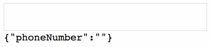

Writing reusable components in React is something every React developer care about (or should care about). Wether it’s to create a toolbox of styled components, to mutualize common behaviors, etc.

Although I frequently use high-order components (with _React-Redux_ for instance), it’s only recently that I heard about the great opportunity they offer to write reusable components more easilly, especially thanks to a great library: [Recompose](https://github.com/acdlite/recompose). Let’s see how with a concrete and complete example.

<!--readmore-->

If you’ve never heard of high-order components (HOC) before, just know that basically, a HOC is a function that takes a component definition (class or function) as parameter, and returns a new component definition, that adds some behavior to the first one. It’s actually the pattern [_Decorator_](https://en.wikipedia.org/wiki/Decorator_pattern), applied to React components.

React’s website has a [really complete page](https://reactjs.org/docs/higher-order-components.html) if you want to know more about HOCs.

A really simple example:

```js
const addBorder = borderWidth => Component => props => (
  <div style={{ borderColor: 'black', borderStyle: 'solid', borderWidth }}>
    <Component {...props} />
  </div>
)

const MyText = <p>Hello!</p>

const MyTextWithBorder = addBorder(5)(MyText)
```

You’ll get a component `MyTextWithBorder` that will show the text "Hello!" with a border of 5 pixels. Here, `addBorder` is what is called a high-order component.

What’s the interest of HOC? Well a really useful pattern is to extract a behavior shared with several components into reusable functions. If you used React with Redux and React-Redux, you probably used the HOC `connect` to map state and actions to props.

As a complete example for this article, we’ll use HOC to create a phone number input component, that will:

- accept only digits, parenthesis, dashes and spaces as input (when the user types them);
- format the phone number when the user leaves the input (on _blur_ event). (We’ll handle only North-American phone numbers: "(514) 555-0199".)



Note that we suppose that our input will be controlled, i.e. will use `value` and `onChange` attributes to know the text to display and how to update it. We also want the value to contain only the phone number digits ("5145550199"), without caring about formatting, and therefor the `onChange` callback to be called with digits only (in `event.target.value`).

To make our HOC easier to write and maintain, we’ll use the library _Recompose_, which offers a great number of utility functions to create HOC. We’ll see some of these in the article.

To develop our component, we’ll create two reusable HOC, one for each of the two points above. This means we’ll want our final component to defined as:

```js
const PhoneNumberInput = formatPhoneNumber(
  forbidNonPhoneNumberCharacters(props => <input {...props} />)
)
```

This is a good place to introduce the first _Recompose_ function we’ll use: `compose`. It composes several HOC to merge them into one, so we can write something much clearer:

```js
const PhoneNumberInput = compose(
  formatPhoneNumber,
  forbidNonPhoneNumberCharacters
)(props => <input {...props} />)
```

And because we’ll want our HOC to be as reusable as possible (to format something other than phone numbers for instance), we’ll make them more generic:

```js
// Only keep digits, spaces, dashes and parenthesis
const forbiddenCharactersInPhoneNumber = /[^\d\s\-()]/g

// '5145551234' => '(514) 555-1234'
const formatPhoneNumber = value =>
  value.replace(/^(\d{3})(\d{3})(\d{4})$/, '($1) $2-$3')

// '(514) 555-1234' => '5145551234'
const parsePhoneNumber = formattedPhoneNumber =>
  formattedPhoneNumber.replace(/[^\d]/g, '').slice(0, 10)

const PhoneNumberInput = compose(
  formatInputValue({
    formatValue: formatPhoneNumber,
    parseValue: parsePhoneNumber
  }),
  forbidCharacters(forbiddenCharactersInPhoneNumber)
)(props => <input {...props} />)
```

Can you already see how this will become awesome, if we can reuse only our two HOC to format money amounts, social security numbers, and everything else, just by using the right parameters? 😉

The really interesting point is that here I use the base `<input>` component, but we could also use any component, as long as it uses `value`, `onChange` and `onBlur`. So we can imagine using our phone number input with React Native, or Material-UI, etc.

Okay, now comes the important part, writing our two HOC using Recompose functions.

## First HOC: only accept some characters

The idea here is that when the input value is changed (`onChange` event), we’ll intercept this event to remove every forbidden characters from the value, then call parent `onChange` with the clean value.

Here we’ll use `withHandlers` function to add new event handlers as props to the encapsulated component. The good thing is that we have access to our component props (here we’ll use `onChange`) to create our handler:

```js
const forbidCharacters = forbiddenCharsRegexp =>
  withHandlers({
    onChange: props => event => {
      // Remember `onChange` prop is not required (even if
      // here nothing would happen if it´s not defined).
      if (props.onChange) {
        const value = event.target.value
        const cleanValue = value.replace(forbiddenCharsRegexp, '')
        // We don’t mutate original event, but we clone it and
        // redefine the event.target.value with cleaned value.
        const newEvent = {
          ...event,
          target: { ...event.target, value: cleanValue }
        }
        // We dispatch our event to parent `onChange`.
        props.onChange(newEvent)
      }
    }
  })
```

Remember that as much as possible the component we create from another one must be compliant with the first one in its interface. It should accept the same properties with the same types.

Now if we want for instance to create a number field that will accept only digits, we can write:

```js
const NumericField = forbidCharacters(/[^\d]/g)(props => <input {...props} />)
```

We now have our first HOC to forbid some characters, now let’s write the second one, a bit more complex, to format user input.

## Second HOC: format input value

For our second HOC, we’ll have to use a local inner state to store the input value without giving it to the encapsulating component. Remember we want to format the input value only when the focus is lost (_blur_ event).

Recompose has a very simple function to add a local state to a component: `withState`. It takes as parameter the name of state attribute (that will be given as prop to child component), the name of the function prop to update this state attribute (also given as prop), and its initial value (static value, or a function taking props as parameter and returning the value).

To add our state we’ll write:

```js
withState(
  'inputValue',
  'setInputValue',
  // formatValue is one of our HOC parameters
  props => formatValue(props.value)
)
```

Easy, right? 😉

Now that we have our state, we must use update it when the input value is changed, so we’ll define a custom `onChange` handler:

```js
withHandlers({
  onChange: props => event => {
    props.setInputValue(event.target.value)
  },
  // ...
```

And on _blur_ event, we’ll format the value, call parent `onChange` and `onBlur` props, and update the displayed value with for formatted value:

```js
  // ...
  onBlur: props => event => {
    // parseValue is the other parameter of our HOC
    const parsedValue = parseValue(props.inputValue)
    const formattedValue = formatValue(parsedValue)
    props.setInputValue(formattedValue)
    // We don’t mutate original event, but we clone it and
    // redefine the event.target.value with cleaned value.
    const newEvent = {
      ...event,
      target: { ...event.target, value: parsedValue }
    }
    if (props.onChange) {
      props.onChange(newEvent)
    }
    if (props.onBlur) {
      props.onBlur(newEvent)
    }
  }
)
```

The last step for our HOC is to ensure that only the props accepted by `<input>` component will be passed to it. To do so, we’ll use Recompose’s `mapProps` function to create a new prop object from existing props, and also _lodash_’s `omit` function to exclude some properties from an object to create a new one:

```js
mapProps(props => ({
  ...omit(props, ['inputValue', 'setInputValue']),
  value: props.inputValue
}))
```

Assembling everything with `compose`, we’ll get:

```js
const formatInputValue = ({ formatValue, parseValue }) =>
  compose(
    withState('inputValue', 'setInputValue', props => formatValue(props.value)),
    withHandlers({
      onChange: props => event => {
        props.setInputValue(event.target.value)
      },
      onBlur: props => event => {
        const parsedValue = parseValue(props.inputValue)
        const formattedValue = formatValue(parsedValue)
        props.setInputValue(formattedValue)
        const newEvent = {
          ...event,
          target: { ...event.target, value: parsedValue }
        }
        if (props.onChange) {
          props.onChange(newEvent)
        }
        if (props.onBlur) {
          props.onBlur(newEvent)
        }
      }
    }),
    mapProps(props => ({
      ...omit(props, ['inputValue', 'setInputValue']),
      value: props.inputValue
    }))
  )
```

That’s it! We have our two high-order components, we can use them to create our phone input field component! Below you can find the JSFiddle containing the complete source code for this example, and test the result. Don’t hesitate to fork the [JSFiddle](https://jsfiddle.net/scastiel/prme4k6L/) to play with Recompose or create your own high-order components.

<iframe width="100%" height="300" src="//jsfiddle.net/scastiel/prme4k6L/8/embedded/js,result/" allowfullscreen="allowfullscreen" frameborder="0"></iframe>

I hope this article made you want to know more about Recompose and high-order components in general. I’m convinced HOCs create a new way to write reusable components; no doubt we’ll here about them more and more in the future 😀.

Some ressources to go further:

- [Recompose API documentation](https://github.com/acdlite/recompose/blob/master/docs/API.md) is quite complete, although in my opinion it lacks some example to understand some complexe functions;
- [React page about HOCs](https://reactjs.org/docs/higher-order-components.html) contains a lot of information, for instance what you shouldn’t do with HOCS 😉
- [React Higher Order Components in depth](https://medium.com/@franleplant/react-higher-order-components-in-depth-cf9032ee6c3e): a great introduction to HOCs
- [Why The Hipsters Recompose Everything](https://medium.com/javascript-inside/why-the-hipsters-recompose-everything-23ac08748198): a cool intro to concepts of Recompose (seems a little outdated…)
