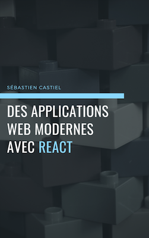

Voilà quelques mois, j’étais à la recherche d’un nouveau projet personnel. Bien souvent ce type de recherche aboutit au développement d’une nouvelle application web ou mobile, mais cette fois-ci, j’ai plutôt décidé d’écrire un livre. Ce n’est pas la première fois, j’avais écrit [un livre consacré à Node.js](https://github.com/scastiel/decouvrir-nodejs) en 2013. Le projet m’avait beaucoup plu, bien que cela prenne beaucoup de temps.

La première question qui s’est alors posée concerne naturellement le sujet du livre. Il allait de soi que ce serait un livre technique, mais à propos de quelle technique ? La réponse m’est venue tout aussi naturellement, ce serait React.

## Pourquoi React ? Pourquoi un livre ?

- parce que c’est la technologie que je maîtrise le mieux aujourd’hui pour l’utiliser professionnellement depuis un an, et à titre personnel depuis plusieurs années ;
- parce que non seulement React a beaucoup de succès aujourd’hui, mais je suis convainvu que le meilleur est à venir ;
- parce que son apprentissage n’est pas des plus aisés et cache beaucoup de subtilités, d’où la difficulté à débuter simplement grâce à des tutoriels ;
- parce que j’adore ça !

De plus, une rapide recherche m’a montré que les livres en français sur React sont rares, pour ne pas dire inexistants. Plusieurs raisons possibles :

- plus personne ne lit de livres pour apprendre une technologie ;
- pour ceux qui s’intéressent aux livres cela ne pose pas de problème de lire en anglais ;
- personne n’a pris le temps d’écrire un livre alors que la demande est là !

J’ai naïvement choisi de retenir la troisième hypothèse (car pour ma part j’adore apprendre une techno avec un livre), tout en restant conscient qu’il est possible que cela n’intéresse finalement pas suffisamment de monde. C’est pour cette raison que j’ai décidé d’écrire ce livre en [_lean publishing_](https://leanpub.com/manifesto). Ce modèle porté par la plateforme [LeanPub](https://leanpub.com) consiste à publier un livre au fur et à mesure de sa publication, en proposant aux acheteurs de faire leurs retours au cours de l’écriture, pour laisser la possibilité à l’auteur de corriger ou améliorer les chapitres écrits ou futurs.

Avec cela, j’ai pu tester qu’il y avait un intérêt pour le livre dès que j’en ai eu l’idée, avant même de commencer à l’écrire (en récoltant des adresses email). Puis une fois le premier chapitre publié, ayant vendu cinq exemplaires, cela m’a convaincu que ça valait le coup. Avoir cinq personnes qui achètent un seul chapitre en vous faisant confiance pour écrire des chapitres supplémentaires de qualité, c’est plutôt motivant 😊

## Où en est le livre aujourd’hui ?

Aujourd’hui les trois premiers chapitres sont publiés. Cela me rend réellement content car ils représentent la première partie du livre, la plus difficile à écrire car s’adressant évidemment aux débutants React.

Le livre est [en vente sur LeanPub](https://leanpub.com/apps-web-modernes-react/), au prix suggéré de 25 $US (LeanPub ne permet pas d’acheter avec d’autres devises…). J’apprécie particulièrement que LeanPub offre une politique de satisfait ou remboursé de 45 jours, même si jusque là il n’y a eu aucune demande de remboursement 😉

Je prends actuellement une petite pause de deux ou trois semaines dans l’écriture du livre afin de me consacrer à un peu à sa promotion. L’idée n’est pas réellement de vendre plus d’exemplaires — ce n’est pas une priorité pour le moment — mais plutôt d’obtenir des retours. C’est pourquoi lorsqu’on me le demande je n’ai aucune objection à fournir gratuitement un exemplaire.

## Quels sont les plans pour le futur ?

Tout d’abord, il me faut définir le plan des prochains chapitres. J’ai déjà plusieurs idées, il me reste pour chacune à la mettre dans la balance avec ma maîtrise du sujet, l’intérêt potentiel pour les lecteurs, et la pertinence d’y consacrer un chapitre par rapport à un simple tutoriel sur un blog. J’aimerais d’ailleurs impliquer les lecteurs ou toute personne intéressée ; je réfléchis à la manière de faire cela au mieux.

Lorsque le livre sera terminé (pour la fin de l’année je l’espère), je prévois de le vendre également sur Amazon (en plus de LeanPub) car c’est la place de marché de choix même pour les livres autopubliés. Et qui sait, peut-être si le succès est au rendez-vous, en faire une version imprimée !

Il me reste encore beaucoup de chemin à parcourir, mais je n’ai jamais été plus enthousiaste que maintenant à propos de ce projet.

Si vous avez des questions sur le livre n’hésitez pas à laisser un commentaire ou à me contacter directement [sur Twitter](https://twitter.com/scastiel) par exemple. Il y aurait d’autres sujets à aborder, par exemple le workflow et les outils utilisés pour écrire le livre, cela mériterait peut-être un autre article 😉
