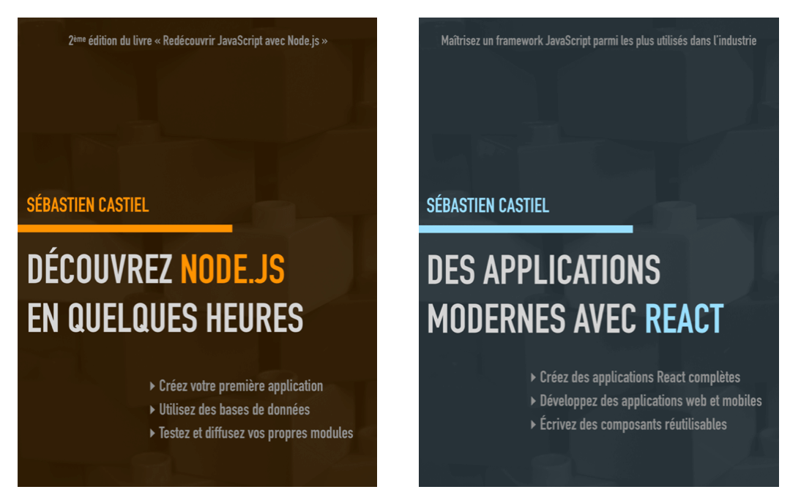
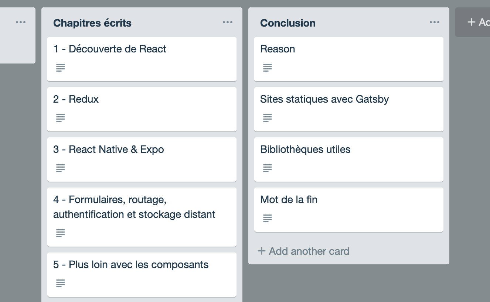
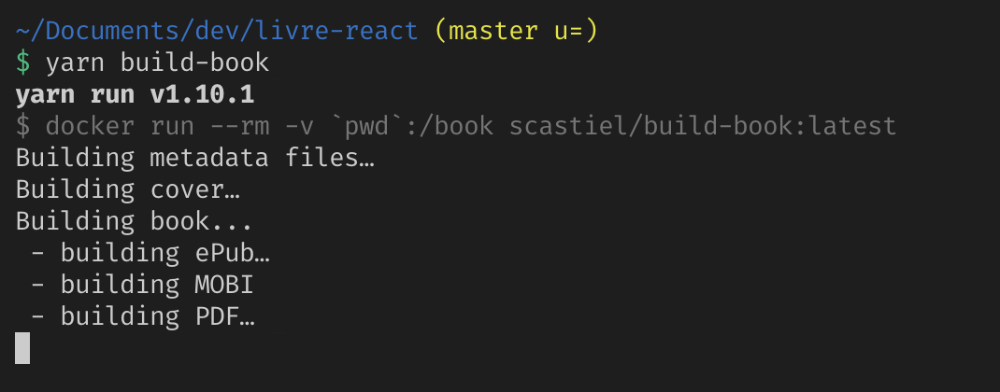
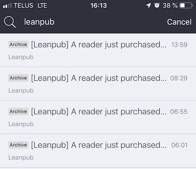

Big week for me: I finished writing my [eBook in French about React](https://www.masterreact.io/livre), and I couldn’t be more proud. Eight months, and it was not easy, but it’s so worth it. In this post I wanted to expose a few thoughts about what happens when you write a technical book.

## Why? From the idea to starting writing

Actually this isn’t my first eBook, I already wrote one about Node.js a few years ago. But it was much smaller, and I was decided to dedicate a lot more energy in this new one.

<figure>
  
  <figcaption>My first eBook (left) and the new one (right). I took the opportunity to make similar covers!<figcaption>
</figure>

I love writing technical articles (on this blog or other platforms such as [Dev.to](https://dev.to)), and I always thought I’d like to write another book. React has been my favorite technology for several years, and luckily for me there was almost no book about it in French. I know every (French) developer is not necessarily comfortable in English, so I’m convinced it’s important to have books and articles in French too.

So the choice was not difficult to make: a book about React could really be needed somewhere by someone!

## Publishing in-progress content

From the beginning I wanted to publish the content as soon as I write it, chapter by chapter. I thought this was a good opportunity to:

- get feedback from readers;
- be motivated by people reading your work and trusting you.

For these reasons I chose [LeanPub](https://leanpub.com) platform, as it integrates this philosophy at its core. I can’t say I received a lot of feedback from readers, but the only fact that a few people trust you and buy your unfinished book is a huge source of motivation and energy 🙂

## What should I talk about?

At start it was an easy question to answer: I wanted to write a first chapter about React _basics_ (components, state, JSX, etc.), a second one about Redux, and a third one about React Native and Expo. But for the next ones it wasn’t that easy.

I didn’t want to present libraries that could be deprecated in a few months, or that would require only a quick tutorial to be used. I wanted to write about useful practices that would be used by a great number of React developers.

<figure>
  
  <figcaption>Trello revealed itself to be an excellent tool to organize content ideas.<figcaption>
</figure>

For instance I could have written a chapter about GraphQL, there would have been a lot to talk about. Or maybe GatsbyJS to write static websites. I preferred dedicate the fourth chapter to several notions that could be found in a great number of apps: forms, routing, authentication and accessing a distant API. Of course I had to choose libraries (respectively Formik, React-Router and Firebase), but I really hope that practices I described can be applied to other libraries or services.

## The importance of the visual aspect

LeanPub offers a nice workflow to publish a book. Basically you can write using Markdown, push to a Git repository, and the ePub, PDF and MOBI files are generated automatically. I began writing using this workflow, but very quickly I found myself very demanding about the visual aspects of the content, especially the PDF.

<figure>
  
  <figcaption>A very customized and optimized workflow.<figcaption>
</figure>

So I created my own workflow to convert Markdown files to ePub and PDF, and thanks to [Pandoc](https://pandoc.org/) I’m very proud of the result. It’s not an easy thing to do and it takes time, but I know I will be able to reuse everything for potential future books. Maybe I’ll write a full article about this workflow so other technical writers could benefit from it.

## So what now?

Now my book is available on LeanPub and Amazon, I sold a few copies on the first coupe of days and it’s awesome! I’m waiting for some reviews, comments, suggestions…

<figure>
  
  <figcaption>My favorite e-mails these days!<figcaption>
</figure>

I also started a blog with posts in French, [MasterReact.io](https://www.masterreact.io), which will be a good complement to the book: tutorials for all programming levels, new features, etc. And even some excerpts from the book.

My goal is to continue posting articles there, and maybe writing new material for a second edition. React is changing very fast, I’m sincerely wondering if a new React introduction (my first chapter) could integrate hooks from the beginning, instead of class components for instance.

I’m really open to questions you could have if you consider writing a technical book some day (definitely you should, especially if you enjoy writing technical articles). Please feel free to ask in comments 😉
