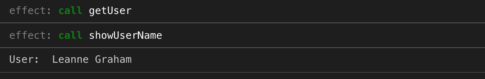
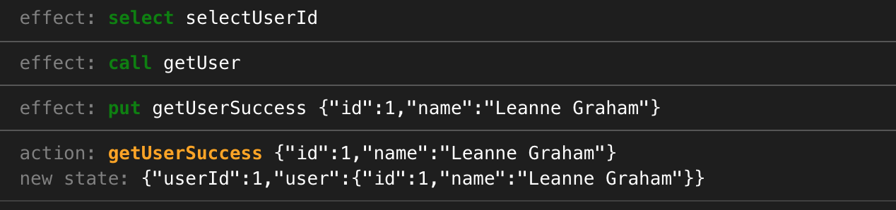
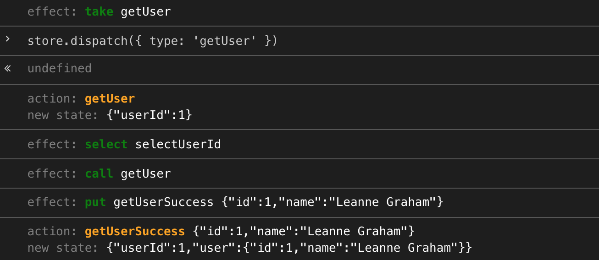
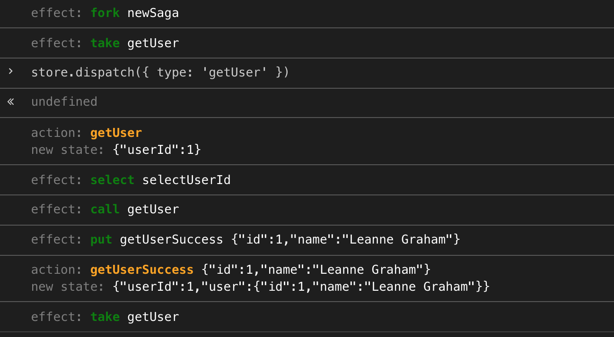

You can use everyday a library such as React, Redux or Redux-Saga. You can be perfectly efficient with it. You can be able to tell others why it is nice or not, and wether they should use it or not. But at the same time it’s possible you consider it a bit magic. It does a lot under the hood, and you can’t explain how it works. And that makes it difficult for debugging, testing, or just to use all its features.

I used to live exactly that with Redux-Saga. And in my opinion, one of the best ways to understand how a library works is to try to implement it yourself. Well, obviously a minimalistic version of it.

_This article is not an introduction to Redux or Redux-Saga. There are plenty of them on the web, including their respective official documentations ([Redux](https://redux.js.org/basics/basic-tutorial), [Redux-Saga](https://redux-saga.js.org/docs/introduction/BeginnerTutorial.html)). I suppose you already know basics but want to know more about what’s really inside._

In this article, I’ll show you how to write basic implementations of Redux and Redux Saga. If you use them in your React projects, you could discover they’re not as magical as they may seem.

Final source code and samples are available [in this sandbox](https://codesandbox.io/embed/thirsty-glade-0g196), if you want to see the result right now.

## Create a store with Redux

The base concept of Redux is the store. To create one, you’ll need a reducer and an initial state. If we suppose that the initial state is determined by what the reducer returns when no state is provided to him, we can define a `createStore` function taking only a reducer as parameter:

```js
const createStore = reducer => ({
  state: reducer(undefined, 'redux-init')
  // ...
})
```

When we want to dispatch an action, the store has to update its state, using the reducer to get its new value:

```js
dispatch(action) {
  this.state = reducer(this.state, action)
}
```

The base functionality is here, but our store is pretty useless if we can’t subscribe to state updates. To handle these subscriptions we’ll use a publicly accessible _event emitter_. Similarly, we’ll offer an event emitter for actions; we’ll use it when implementing Redux-Saga.

```js
import { EventEmitter } from 'events'

export const createStore = reducer => ({
  state: reducer(undefined, 'redux-init'),
  stateEmitter: new EventEmitter(),
  actionsEmitter: new EventEmitter(),

  dispatch(action) {
    this.state = reducer(this.state, action)
    this.actionsEmitter.emit(action.type, action)
    this.stateEmitter.emit('new_state')
  }
})
```

That’s it. Does it seem too easy for you? Let’s try it to see if it actually works.

Let’s first create a reducer:

```js
const initialState = { name: undefined }

const reducer = (state = initialState, action) => {
  switch (action.type) {
    case 'setName':
      return { ...state, name: action.payload }
    default:
      return state
  }
}
```

Then let’s create our store and make it available globally so we can play with it in the console:

```js
const store = createStore(reducer)
window.store = store
```

In the console, we can check that our state is initialized correctly, then subscribe to state updates, and dispatch an action:

```
> store.state
Object {name: undefined}
> store.stateEmitter.on('new_state', () => console.log('New state:', store.state))
EventEmitter {...}
> store.dispatch({ type: 'setName', payload: 'Jean Valjean' })
undefined
New state: Object {name: "Jean Valjean"}
```

Everything looks fine, right? And our Redux implementation is only ten lines of code! Of course the actual Redux has a lot more features or optimizations. For example, [middlewares](https://redux.js.org/advanced/middleware). Although they’re not that complicated to add to our implementation, if you feel inspired 😉

Second task, rewrite Redux-Saga. It is a little more complicated, since the base concepts of the library are themselves more difficult to understand.

## Implementing Redux-Saga effects

First thing to know: sagas are generator functions. Said quickly, a sort of function which execution is stopped when encountering a `yield` instruction, and resuming shortly after 🤔. If you want to understand them deeply I suggest you to read [Generators chapter on _ExploringJS_](https://exploringjs.com/es6/ch_generators.html), or maybe just to have a look at [what Babels transpiles a generator function to](https://babeljs.io/repl/#?babili=false&browsers=&build=&builtIns=false&spec=false&loose=false&code_lz=GYVwdgxgLglg9mAVAAgLYE8DiBTM2BOAhlHPgBRgCUyA3gFDLLozYA2AJsmMgNTICMDJiw5deyAExD82KCHzdufAMx0AvnSA&debug=false&forceAllTransforms=false&shippedProposals=false&circleciRepo=&evaluate=false&fileSize=false&timeTravel=false&sourceType=module&lineWrap=true&presets=es2015%2Creact%2Cstage-2&prettier=false&targets=&version=7.5.5&externalPlugins=). Again, nothing magic about that!

Generators applied to sagas may be easier to get when you understand the concept of _effect_. Sagas must be pure functions, i.e. not trigger side effects, such as making an HTTP request, logging something, or accessing the store. The trick for a saga is to stop its execution with some kind of message like ”I need to read this value in the state, get back to me when you have it”. This message is an effect.

Redux-Saga offers some base effects we’ll implement ourselves:

- `select`: read the state with a selector
- `call`: call a function (potentially asynchronous)
- `put`: dispatch an action
- `take`: wait for an action with a specific action type
- `fork`: create a new saga with a new execution context

Effects are actually objects (as are actions), so each type of them has its helper to create it more easily:

```js
export const take = actionType => ({ type: 'take', actionType })
export const select = selector => ({ type: 'select', selector })
export const call = (fn, ...args) => ({ type: 'call', fn, args })
export const put = action => ({ type: 'put', action })
export const fork = (saga, ...args) => ({ type: 'fork', saga, args })
```

With the real Redux-Saga, a saga is run by creating a middleware and adding it to the Redux store. In our implementation, to keep it simpler we’ll create a function `runSaga`, taking as parameter the store and the saga:

```js
export async function runSaga(store, saga, ...args) {
  // ...
}
```

Now is the time to handle our saga and the effects it triggers.

## Call a function with `call` effect

The easier way to understand sagas and JavaScript’s generator functions is to remember they basically return an iterator. Each of the value returned by the iterator is an effect, and we call iterator’s next value with the response expected by the effect:

```js
const it = saga() // saga is a generator function: function* saga() { ...
let result = it.next() // result has `done` and `value` attributes
while (!result.done) {
  const effect = result.value
  // do something with the effect
  result = it.next(/* value we want to return to the saga */)
}
```

Let’s illustrate this with this first implementation of `runSaga`, handling only `call` effects for now:

```js
export async function runSaga(store, saga, ...args) {
  try {
    const it = saga(...args)

    let result = it.next()
    while (!result.done) {
      const effect = result.value
      // See `logEffect` function in src/logger.js
      // at https://codesandbox.io/embed/thirsty-glade-0g196.
      logEffect(effect)

      switch (effect.type) {
        case 'call':
          result = it.next(await effect.fn(...effect.args))
          break

        default:
          throw new Error(`Invalid effect type: ${effect.type}`)
      }
    }
  } catch (err) {
    console.error('Uncaught in runSaga', err)
  }
}
```

We basically handle the iterator returned by the saga as we would handle any iterator. And depending the effect, we decide what we do. Here we call the function referenced by the `call` effect with associated parameters:

```js
result = it.next(await effect.fn(...effect.args))
```

_Note that we use `await` to wait for the promise to be resolved (it even works on non-promise values, good for us!). `await` has similarities with `yield` instruction, and before the `async`/`await` syntax landed in ES2015+, [some libraries](https://github.com/tj/co) used generator functions to simulate it._

Let’s use this first implementation with an example.

```js
export const getUser = async id => {
  const res = await fetch(`https://jsonplaceholder.typicode.com/users/${id}`)
  const response = await res.json()
  return { id: response.id, name: response.name }
}

const showUserName = user => {
  console.log('User:', user.name)
}

function* mySaga() {
  const user = yield call(getUser, 1)
  yield call(showUserName, user)
}

// I created a basic store, you can find it in src/samples/store.js
// at https://codesandbox.io/embed/thirsty-glade-0g196.
runSaga(store, mySaga)
```

By running this example you should see something like this in your console:



As you can see our `runSaga` function first intercepted one `call` effect, called `getUser` function and waited for the result since it’s an asynchronous function. Then with the second `call` effect it called `showUserName` function.

## Read and write to the store with `select` and `put` effects

Next step is to be able to read from and write to the store, thanks to `select` and `put` effects. Now we have the boilerplate to handle effects, it should not be too complicated to understand.

```js
case 'select':
  result = it.next(effect.selector(store.state))
  break

case 'put':
  store.dispatch(effect.action)
  result = it.next()
  break
```

For `select` effects, we just call the given selector passing it the state as parameter. For the `put` ones, we dispatch the given action. Let’s test these effects by improving our sample.

Now our saga will get a user ID from the state, then call an API to get the user infos, and finally dispatch an action to save these info in the state.

```js
function* mySaga() {
  const userId = yield select(state => state.userId)
  const user = yield call(getUser, userId)
  yield put({ type: 'getUserSuccess', payload: user })
}
```

You should now see something like this in your console:



This works very well, and you’ll admit that this kind of saga is very common. But something is still missing. When you write sagas, you want to react to certain actions. Here we just ran our saga, but how can we run this process only when a given action occurs?

Usually we’d use `takeEvery` helper to tell Redux-Saga we want to execute some saga when an action with the given type is dispatched. But before being able to implement `takeEvery`, we need to implement two base effects: `take` and `fork`.

## Wait for a specific action with `take` effect

`take` effects wait for any action with a given type, and resumes the saga only then. For our example, we want to get the user info only when an action with type “getUser” occurs.

Implementing `take` effect is not difficult, we just need to subscribe to our store’s actions event emitter `actionsEmitter`, and resume the iterator with the next matching action. By using an approach based on promises, it looks liek this:

```js
case 'take':
  const action = await new Promise(
    resolve => store.actionsEmitter.once(effect.actionType, resolve)
  )
  result = it.next(action)
  break
```

Now we can update our saga to get user info only on “getUser” action:

```js
function* mySaga() {
  yield take('getUser')
  const userId = yield select(state => state.userId)
  const user = yield call(getUser, userId)
  yield put({ type: 'getUserSuccess', payload: user })
}

// ...
// Dont’t forget to make the store available for tests:
window.store = store
```

You’ll notice in the console that we just have one effect triggered: the `take` one. You’ll have to dispatch a “getUser” action for the rest of the saga will be executed:



That’s almost perfect, but if you try to dispatch a second time the same action, you’ll notice that nothing happens… That’s because `take` only subscribes to the next action with given type, not all of them. One solution to react to every “getUser” actions could be to wrap our saga into an infinite loop:

```js
function* mySaga() {
  while (true) {
    yield take('getUser')
    const userId = yield select(state => state.userId)
    const user = yield call(getUser, userId)
    yield put({ type: 'getUserSuccess', payload: user })
  }
}
```

It works well, and don’t be afraid it’s not actually the kind of infinite loops we tend to forbid, it’s just an infinite iterator. The saga will never terminate, but the content of the loop will be executed only once per “getUser” action dispatched.

Yet, it’s still not perfect. What if we want to subscribe to two action types, let’s say “getUser” and “getDocuments”. `take` effects block the saga execution, so it’s not possible to write:

```js
while (true) {
  yield take('getUser')
  // do something for user

  yield take('getDocuments')
  // do something with documents
}
```

Well it’s possible, but it won’t give the expected behavior. It’ll just handle both action types alternatively.

To be able to handle several actions with `take`, we need to be able to fork our saga to create several execution contexts. That’s the point of the `fork` effect.

## Fork the current saga with `fork` effect

Although it’s probably the most difficult to understand effect, and the most difficult to implement for a real usage (in the real Redux-Saga), our implementation will be very simple.

```js
case 'fork':
  runSaga(store, effect.saga, ...effect.args)
  result = it.next()
  break
```

Basically, we just call our `runSaga` function again, to start a new execution. When forking a saga, you give another saga to execute as parameter. Both saga (the initial one and the new one) will continue to run independently. So now you can write:

```js
function* usersSaga() {
  while (true) {
    yield take('getUser')
    // do something for user
  }
}

function* documentsSaga() {
  while (true) {
    yield take('getDocuments')
    // do something with documents
  }
}

function* mySaga() {
  yield fork(usersSaga)
  yield fork(documentsSaga)
}
```

Three sagas will run in parallel: one for the users, one for the documents, and the main one. Notice that the main one terminated very quickly.

Forking a saga, create infinite loops and waiting for a given action type is very common. But if you don’t remember using `fork` and `take` that often, it maybe because you prefer using the very helpful `takeEvery`.

## React on specific actions with `takeEvery`

`takeEvery` is just a helper to achieve what we did more easily. For a given action type, it forks the saga, creates an infinite loop, takes all actions with this type, and run the new saga, passing it the action as parameter.

```js
export function* takeEvery(actionType, saga) {
  yield fork(function* newSaga() {
    while (true) {
      const action = yield take(actionType)
      yield* saga(action)
    }
  })
}
```

Notice the use of `yield*` instruction. Here we don’t want to trigger an effect, we just want to execute the saga, in the same execution context. We use `yield*` to call `takeEvery` too. Have a look at the final version of our saga:

```js
function* userSaga() {
  const selectUserId = state => state.userId
  const userId = yield select(selectUserId)
  const user = yield call(getUser, userId)
  yield put({ type: 'getUserSuccess', payload: user })
}

function* mySaga() {
  yield* takeEvery('getUser', userSaga)
}
```

_Note: in real Redux-Saga you don’t have to use `yield*`, you can just use `yield`. This is because their implementation took care to check, when an effect is triggered, if this effect is a generator function. If yes, treat it as if it was called with `yield*`._

As you can see, in this implementation `takeEvery` is not really an effect, just a helper to trigger other effects.

The trace in the console is really interesting:



Before we dispatch anything, the saga is forked (`fork`) and waits for a “getUser” action (`take`). When we dispatch the action, `select`, `call`, and `put` effects are triggered, then the saga waits for the next “getUser” action.

This concludes our Redux Saga implementation and this article. The final code with samples is available in this [CodeSandbox](https://codesandbox.io/embed/thirsty-glade-0g196).

## That’s all folks!

I hope that after reading this article you understand better Redux and Redux Saga. You understood the goal was not to learn how to create your own implementations and use them in production.

But now you can see that there is nothing magic in these libraries, nor there is in most open source libraries. By learning how to rewrite minimalistic and naive implementations, you discover that they’re not as complicated as they may seem, even for experienced developers.

Redux and Redux Saga (and React too) are great not because someone invented very complex concepts, but because someone took a lot of time to create easy concepts to solve complex problems.

_Many thanks to [Marvin](https://mobile.twitter.com/mfrachet) for his review. Check [his blog](https://acodingdance.io/), it’s awesome too!_
